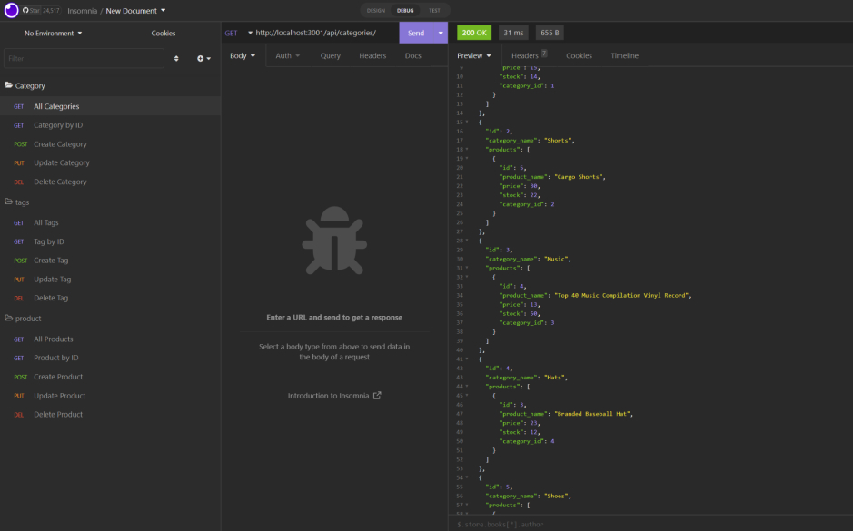
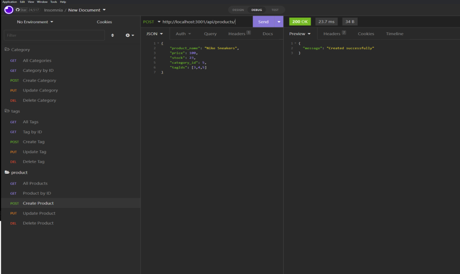

# E-Commerce Back End ORM project


## Description

This is an e-commerce backend that links to a database. A database is essential to any application that collects data. This application uses JavaScript, Sequelize, Express, Node, and MySQL to build out a backend of the e-commerce site. We can choose from many ORM tools, but for this module we'll use Sequelize. A popular JavaScript ORM that uses object-oriented programming, Sequelize enables us to communicate with Postgres, MySQL, MariaDB, SQLite, and Microsoft SQL Server using Node.js. QL.

---

### Table of Contents

- [Installation](#installation)
- [Usage](#usage)
- [Technologies](#technologies)
- [User-Story](#user-story)
- [Acceptance-Criteria](#acceptance-criteria)
- [Screenshots](#screenshots)
- [CodeSnippets](#codeSnippets)
- [License](#license)
- [Contributors](#contributors)
- [Tests](#tests)
- [Important-Information-Questions](#important-information-questions)

---

## Installation

the User can install all the required packages by using npm install. Node.js, Sequelize, and Express were used to create this package. 

---

## Usage

This is a back end application that creates REST resources that users can access. 

---

## Technologies

- **MySQL**
- **JavaScript**
- **Insomnia**
- **Node.js**
- **GitHub**
- **Sequelize**
- **Express**

---

## User Story

```md
AS A manager at an internet retail company
I WANT a back end for my e-commerce website that uses the latest technologies
SO THAT my company can compete with other e-commerce companies
```

---

## Acceptance Criteria

```md
GIVEN a functional Express.js API
WHEN I add my database name, MySQL username, and MySQL password to an environment variable file
THEN I am able to connect to a database using Sequelize
WHEN I enter schema and seed commands
THEN a development database is created and is seeded with test data
WHEN I enter the command to invoke the application
THEN my server is started and the Sequelize models are synced to the MySQL database
WHEN I open API GET routes in Insomnia for categories, products, or tags
THEN the data for each of these routes is displayed in a formatted JSON
WHEN I test API POST, PUT, and DELETE routes in Insomnia
THEN I am able to successfully create, update, and delete data in my database
```

## Screenshots

#### Get Categories



#### Post Product



---

## CodeSnippets

#### This function creates a tag and adds an array of products

```Sequelize/Express
Tag.create(req.body)
  .then((tag) => {
    if (req.body.productIds.length) {
      const productTagIdArr = req.body.productIds.map((product_id) => {
        return {
          tag_id: tag.id,
          product_id,
        };
      });
      return ProductTag.bulkCreate(productTagIdArr);
    }
    res.json({ message: "Created successfully"});
  })
  .then((productTagIds) => res.json({ message: "Created successfully"}))
  .catch((err) => {
    console.log(err);
    res.json(err);
  });
```

---

## Tests

N/A

---

## **Important-Information-Questions**

---

## License

The license used on this project was MIT license

[license link](https://opensource.org/licenses/MIT)

## Contributors

Kyle Vance

## Questions

If you have any questions regarding this project, please reach me by email at vanceofalifetime@protonmail.com

[Video Link](https://drive.google.com/file/d/1Zd8tQU8jGkFt3rSo0OYSCpSrnKXD1ytb/view)

[LinkedIn](https://www.linkedin.com/in/kyle-s-vance/)
